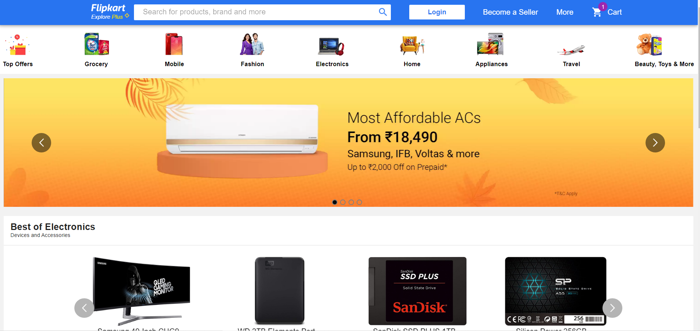
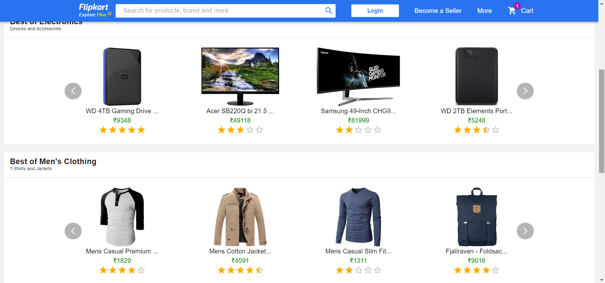

# Flipkart Clone - React Project



## Table of Contents

-   [Introduction](#introduction)
-   [Features](#features)
-   [Demo](#demo)
-   [Screenshots](#screenshots)
-   [Technologies Used](#technologies-used)
-   [Setup Instructions](#setup-instructions)
-   [Usage](#usage)
-   [Contributing](#contributing)
-   [License](#license)

## Introduction

This repository contains a Flipkart clone built using React, aiming to replicate some of the core functionalities of the popular e-commerce platform, Flipkart. The project demonstrates the implementation of frontend features like product listing, search functionality, product details, shopping cart, and more.

## Features

-   Product listing with images, names, prices, and ratings.
-   Product search functionality.
-   Product details page with comprehensive information about the selected item.
-   Shopping cart to add and manage items.
-   User authentication and login.
-   User profile management.
-   Secure checkout process.

## Demo

You can access the live demo of the project [here](https://flipkart-clone-1029.netlify.app/).

## Screenshots




## Technologies Used

-   React: A JavaScript library for building user interfaces.
-   Redux: A predictable state container for managing application state.
-   React Router: For handling routing within the application.
-   Axios: A popular HTTP client for making API requests.
-   HTML & CSS: For structuring and styling the web application.

## Setup Instructions

To run the project locally, follow these steps:

1. Clone the repository: `git clone https://github.com/omkarmhadgut29/Flipkart-Clone---React-Project---pibhwgppgqmi.git`
2. Navigate to the project directory: `cd Flipkart-Clone---React-Project---pibhwgppgqmi`
3. Install the dependencies: `npm install`

## Usage

After completing the setup instructions, you can start the development server:

```bash
npm run dev
```

Visit `http://127.0.0.1:5173/` in your web browser to view the application.

## Contributing

Contributions to this project are welcome. To contribute, follow these steps:

1. Fork the repository.
2. Create a new branch: `git checkout -b my-new-feature`
3. Make your changes and commit them: `git commit -am 'Add some feature'`
4. Push to the branch: `git push origin my-new-feature`
5. Submit a pull request detailing your changes.

Please ensure your code follows the project's coding guidelines and has appropriate test coverage.

## License

The project is licensed under the [MIT License](LICENSE). Feel free to use, modify, and distribute the code as per the terms.
